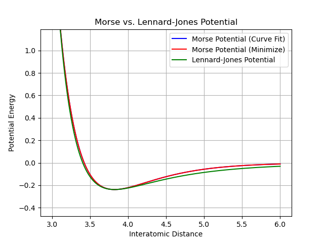

# Morse Potential Implementation (Nicola Aladrah)

Given the existing implementation of the Lennard-Jones (LJ) potential, it is possible to adapt the framework for the Morse potential using equivalent parameter values.

The Lennard-Jones potential is defined as:

$$
U_{\text{LJ}}(r) = 4 \epsilon \left( \left(\frac{\sigma}{r}\right)^{12} - \left(\frac{\sigma}{r}\right)^6 \right)
$$

Where:
- \( $\epsilon$ \) is the depth of the potential well.
- \( $\sigma$ \) is the finite distance at which the inter-particle potential is zero.
- \( $r$ \) is the inter-particle distance.

In contrast, the Morse potential is expressed as:

$$
U_M(r) = D_e \left(1 - \exp\left(-\alpha (r - r_e)\right)\right)^2
$$

Where:
- \( $ D_e $ \) is the well depth.
- \( $\alpha$ \) is a parameter controlling the potential's width.
- \( $r_e$ \) is the equilibrium bond length.

We assume that both potentials have equivalent minima, hence:

$$
\partial_r U_{\text{LJ}} = 4 \epsilon \left( -12 \left( \frac{\sigma}{r} \right)^{13} + 6 \left( \frac{\sigma}{r} \right)^7 \right), \newline
\partial_r U_M = -2 \alpha D_e \exp(-\alpha (r - r_e)) \left( 1 - \exp(-\alpha (r - r_e)) \right)
$$

This implies that the depth of both potentials is the same at or near equilibrium. *This is expected since, physically, curve fitting using either potential function should yield equal minimum well depths* ([Z. Naturforsch. 58a, 615–617 (2003)](#)).  
By performing some fitting, we can approximate $\alpha \approx 1.67 \dots$.  

    

Implementing this value in our code resulted in values that were far from the reference ones. However, by tuning this parameter around the approximate value, a range of $\alpha = [1.01 - 1.07]$ provided a good approximation for the total energy. It is important to note that the values within this range correspond to the system size.
