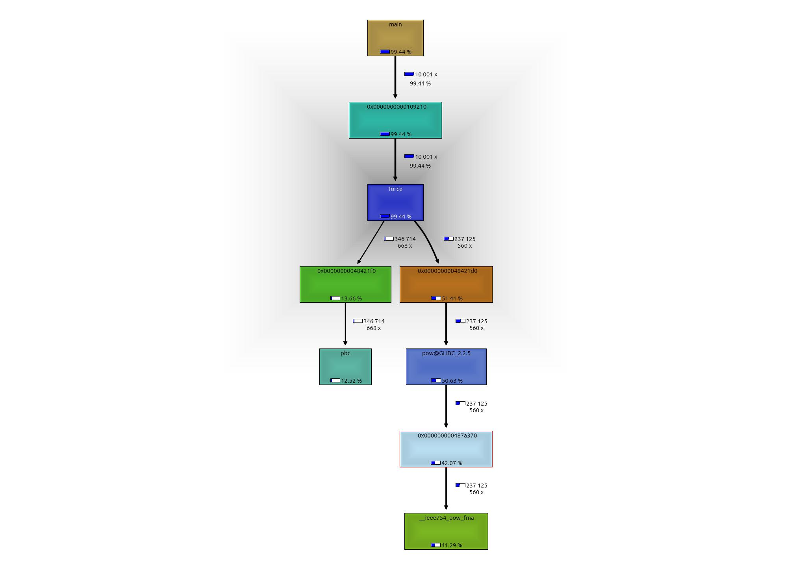
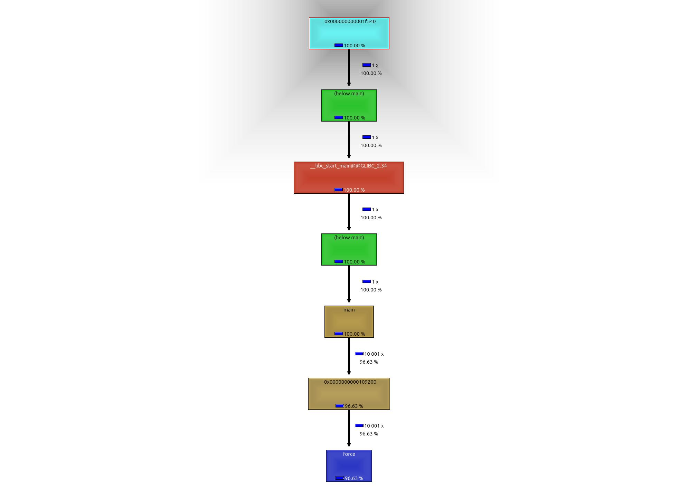
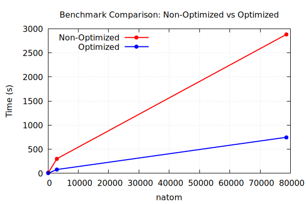
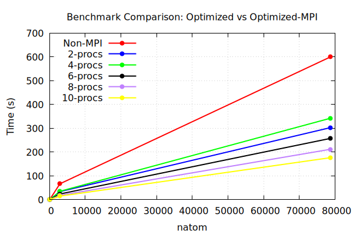
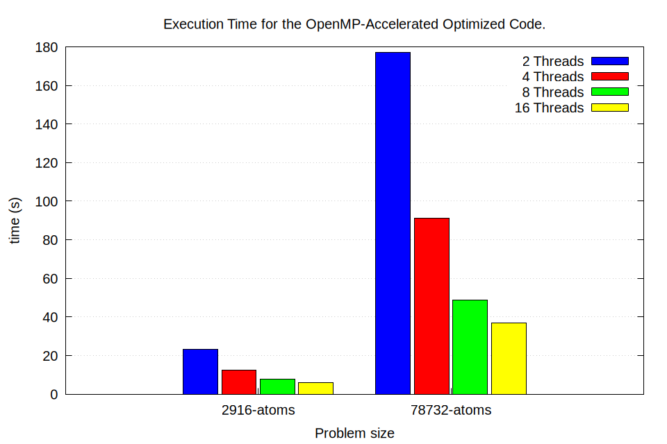
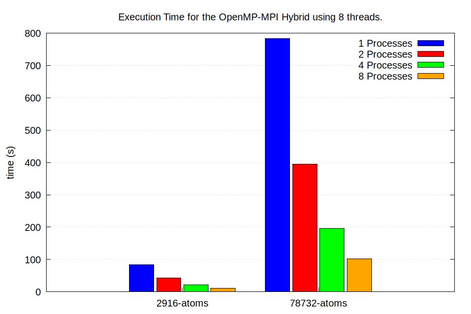
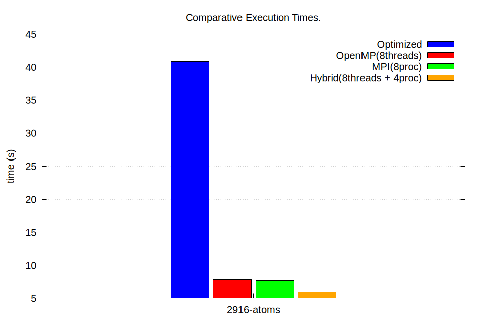
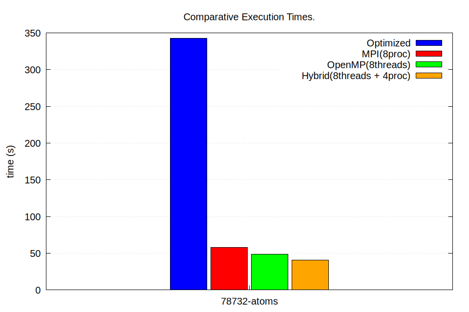

# Lennard-Jones Molecular Dynamic Simulator

This work presents a optimized, and parallelized Lennard-Jones Molecular Dynamics simulator. The code is designed to efficiently simulate large-scale molecular systems.

## Collaborators:

        | Christian Tica         --> openMP                ---> GitHub: cristiano-mhpc
    
        | Nicola Aladrah         --> Optimization          ---> GitHub: NicolaAdrah
    
        | Nisha Nisha            --> MPI                   ---> GitHub: Nisha2592

## Compiler Options:

This code offers various compilation options, including optimized, MPI, OpenMP, and a hybrid OpenMP-MPI approach. The provided `CMakeLists.txt` file facilitates the build process by using `cmake -S . -B build` with the following variables on:
        * `-DENABLE_MPI`            --> To compile with the MPI version  
        * `-DENABLE_OPENMP`         --> To compile with the openMP version  
Note that both the OpenMP and MPI versions are built upon the optimized codebase. To enable unit testing for force, utilities, and Verlet functions, add `-DENABLE_TESTING=ON` to the CMake cache in the serial_code version.  
To optimize performance across all implementations, we utilized the following compiler flags:  

        `-O3 -ffast-math -fexpensive-optimizations -ffp-contract=fast -msse3`  

These flags enable aggressive optimization techniques, including loop unrolling, function inlining, and vectorization.

## Benchmark:

### Optimization stage:

To evaluate the performance impact of optimization, we employed Valgrind and Kcachegrind to profile the optimized and non-optimized code. The profiling process involved running the following:  

* `valgrind --tool=callgrind ./our_executable`
* `kcachegrind callgrind.out.<pid>`

In the case of non-optimized code, we have the following table and call graph,  

        | function |    calls    |
        |:--------:|:-----------:|
        |   pbc    | 346'714'668 |
        |   pow    | 237'125'560 |
        |   sqrt   | 115'571'556 |

    

By applying Newton's Third Law, the `pbc()` function becomes solely dependent on `j`, as the `i`-dependent calculations are precomputed before entering the `j` loop. Thus, studying argon for 108 atoms, we reduced the timing from 300.780 s to 146 s. We employ strength reduction to replace costly pow() function calls with more efficient multiplication operations. Additionally, we avoid unnecessary sqrt() calculations by comparing squared values directly within conditional statements. Adding the previous optimizations together reduced the timing from 300.780 s to 80 s. We can see this easily from the following call graph,

    

where now the calls for pbc is negligible and the force function only call itself. We plot the timing for both the optimized and non-optimized codes,

    

While optimizing larger systems can significantly boost their performance, smaller systems might not see much improvement.  

## MPI

This report analyzes the performance of an optimized computational code executed on varying numbers of atoms using different configurations: An optimized code without message passing interface and with MPI employing 2, 4, 6, 8 and 10 processors. In this implementation, MPI is primarily leveraged to accelerate the computation of forces by distributing the workload across multiple processors. The Force function is adapted to handle this parallelization through the following steps:

* Atom positions are shared across all processes using broadcast communication.
* Process-specific indices are defined to control loop iterations, ensuring tasks are divided based on the total number of processes and their individual ranks.
* Dedicated buffers are utilized to store the computed forces for each process.
* Finally, the computed forces and total potential energy from all processes are gathered and consolidated into the rank 0 process using reduction operations.

This approach is layered on top of the pre-existing optimized codebase to achieve enhanced performance and scalability. The benchmarking data and plot is structured as follows:

| Number of Atoms | W/O MPI | MPI (2 Procs) | MPI (4 Procs) | MPI (6 Procs) | MPI (8 Procs) | MPI (10 Procs) |
|:---------------:|:-------:|:-------------:|:-------------:|:-------------:|:-------------:|:--------------:|
| 108             | 1.610   | 0.621         | 0.805         | 0.616         | 0.5118        | 0.478          |
| 2916            | 66.781  | 33.94         | 35.297        | 24.049        | 18.182        | 14.986         |
| 78732           | 600.235 | 303.002       | 342.45        | 257.68        | 211.958       | 176.681        |

      
  

### Analysis on basis of scalability:

* Larger systems (e.g. 78732 atoms) benefit more significantly from MPI parallelization due to the increased workload justifying the overhead of communication between processors. 
* Smaller systems (e.g. 108 atoms) exhibit diminishing returns when scaling up the number of processors.

### Analysis on basis of efficiency:

* At 108 atoms, the time reduction between 8 and 10 processors is marginal, which indicates a point of saturation where additional processors contribute little to performace.
* For 78732 atoms, the improvement remains notable even with 10 processors, which suggest that workload is large enough to benefit from additional parallel resources.

## OpenMP

In this section, we analyze the speed-up achieved by implementing shared-memory parallelization for the computation of the force vector with OpenMP. The implementation of OpenMP is similar to MPI in that each thread works on its own portion of a large force vector which contains replicated copies of the original force vector. This prevents race condition without declaring atomic operations or critical sections when peforming the reduction. The following plots summarize the execution times in seconds for various number of atoms.  We see that the implementation demonstrates an strong scaling behaviour for 2916 and 78732 number of atoms. This behavior appear to flatten out as more threads are used.   This same strong scaling behavior however  is not seen for 108 atoms. 

| Number of Atoms | (2 Threads) | (4 Threads) | (8 Threads) | (16 Threads) |
|:---------------:|:-----------:|:-----------:|:-----------:|:------------:|
| 108             | 0.647       | 0.485       | 0.602       | 0.749        |
| 2916            | 23.154      | 12.397      | 7.832       | 5.777        |
| 78732           | 177.017     | 91.052      | 48.4745     | 36.794       |

## Hybrid OpenMP-MPI

The same strong scaling behavior in the OpenMP + MPI hybrid can also be observed. Specifically in the plot below, we set `omp_num_threads` equal to 8 and varied the number of mpi processes. The results are derived by running the source code in Leonardo in the Booster partition.

No apparent scaling is observed in the case of the 108 number of atoms. Strong scalbility is exhibited in the case of 78732 number of atoms.

### Comparative Performance

In this section, we give a summary of the comparative execution times of the different parallelization schemes. The optimized version involves optimization from compiler flags as well as the the application of Newton's 3rd law. All the other parallellization schemes are then implemented from this optimized serial version. We see that the MPI and OpenMP versions give comparable execution times while the hybrid version of the two provides an apportunity for further speedup if more compute resources are available.  

